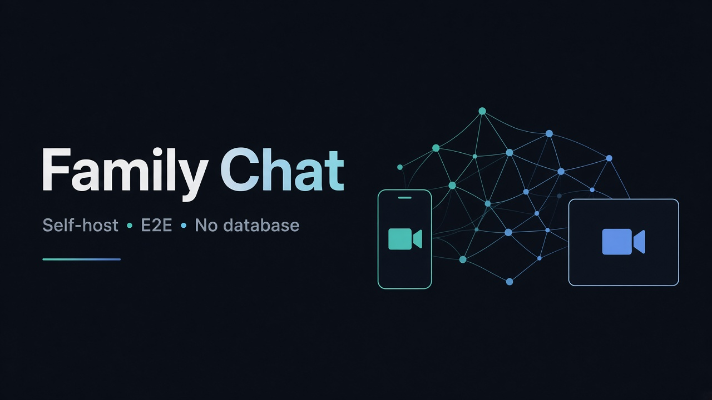
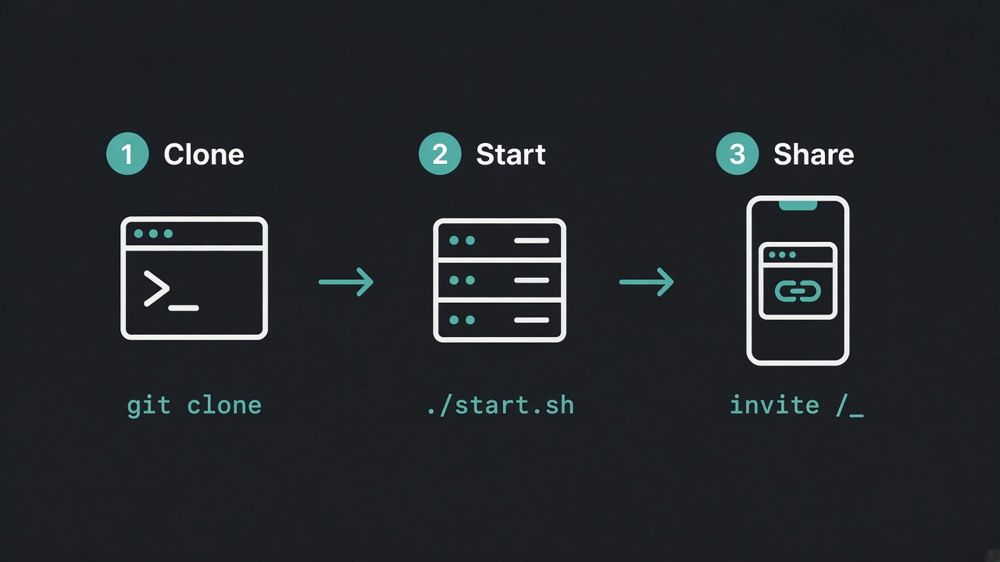

# Family Chat

[](./docs/index.html#ru)
[](./docs/index.html#en)
[](./docs/index.html#blocks)
[](./LICENSE)

<p align="center">
  
</p>

**RU:** Свой семейный мессенджер + видеозвонки с масками. Без базы данных. Без SMTP.  
**EN:** Self-hosted family messenger + masked video calls. No database. No SMTP.

`./start.sh` **сам ставит Node.js 20**, если его нет (Ubuntu/Debian).

> 🎛️ **[Интерактивная инструкция RU / EN / Блокировки](./docs/index.html)**  
> Enable GitHub Pages → folder `/docs` for clickable tabs.

---

## Картинка: 3 шага / 3 steps

<p align="center">
  
</p>

| | RU | EN |
|---|----|----|
| 1 | Скачиваете репо | Download the repo |
| 2 | `./start.sh` (Node ставится сам) | `./start.sh` (auto-installs Node) |
| 3 | Раздаёте invite-ссылку из терминала | Share the invite link from the terminal |

<p align="center">
  
</p>

---

## Быстрый старт / Quick start

> SSH для `git clone` **не нужен** (используйте HTTPS или ZIP).

### Вариант A — git + HTTPS

```bash
sudo apt update && sudo apt install -y git curl unzip
git clone https://github.com/RatseevTimur/video-chat.git
cd video-chat
chmod +x start.sh
./start.sh
```

### Вариант B — ZIP (если git нет / GitHub режется)

```bash
sudo apt update && sudo apt install -y curl unzip
curl -L -o chat.zip https://github.com/RatseevTimur/video-chat/archive/refs/heads/main.zip
unzip -o chat.zip
cd video-chat-main
chmod +x start.sh
./start.sh
```

### Уже скачали ZIP и нет Node? / Already extracted, no Node?

Просто снова:

```bash
cd ~/video-chat-main   # или ваша папка
chmod +x start.sh
./start.sh
```

Скрипт поставит Node 20 + yarn, соберёт клиент и запустит сервер.

### Что появится в терминале / Terminal output

```text
→ https://ВАШ_IP:4000/?invite=XXXX
```

Браузер предупредит о сертификате (self-signed) — это нормально:  
**Дополнительно → Перейти на сайт**. По `http://` Chrome ломает камеру и шифрование.

Share the **https://** link. Accept the certificate warning (Advanced → Proceed).

Порт (если ufw включён, `start.sh` попробует открыть сам):

```bash
sudo ufw allow 4000/tcp && sudo ufw reload
```

Запуск в фоне:

```bash
nohup ./start.sh > chat.log 2>&1 &
tail -f chat.log
```

---

<details>
<summary><strong>🇷🇺 Подробно на русском</strong></summary>

### Что внутри
- Вход по **invite-ссылке** (печатает терминал)
- Почта — только ID (пароль Яндекса не нужен)
- E2E в браузере; на сервере шифротекст **в RAM**
- Видео WebRTC + маски
- Гостевые комнаты: `/guest`

### Если NodeSource недоступен с VPS
Поставьте Node вручную, потом `./start.sh`:

```bash
sudo apt update
sudo apt install -y nodejs npm
# желательно Node 18+
node -v
./start.sh
```

### Закрепить invite после ребута

```bash
INVITE=my-family-secret ./start.sh
```

</details>

<details>
<summary><strong>🇬🇧 Details in English</strong></summary>

- Sign-in via **invite link** printed by the server
- Email is identity only — no mailbox password
- E2E in the browser; server keeps ciphertext in **RAM**
- `./start.sh` auto-installs Node 20 on Ubuntu/Debian
- Keep invite private; public source code does not decrypt messages

```bash
INVITE=my-family-secret ./start.sh
```

</details>

<details>
<summary><strong>🛡 Блокировки / Censorship</strong></summary>

| Tip | RU | EN |
|-----|----|----|
| Host | Российский VPS | VPS your family can reach |
| No git | ZIP + `scp` | ZIP + `scp` |
| NAT | coturn на том же сервере | coturn on the same host |

</details>

---

## Dev

```bash
yarn && yarn --cwd server && yarn --cwd client
yarn dev
```

## License

MIT
